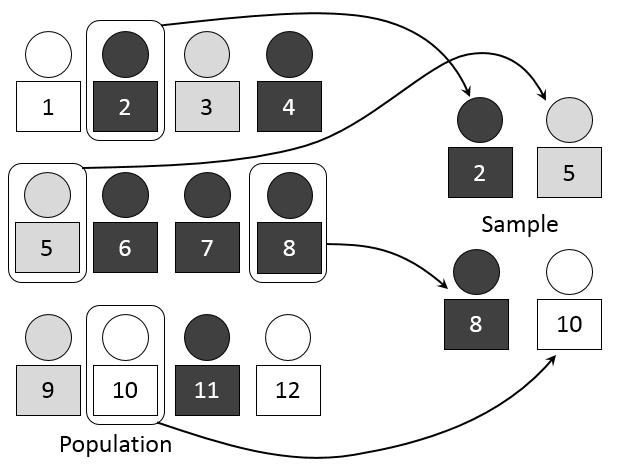

# Statistics

A **descriptive statistic** is a summary statistic that quantitatively describes or summarizes features from a collection of information, while **descriptive statistics** is the process of using and analyzing those statistics.

Some measures that are commonly used to describe a data set are measures of **central tendency** and measures of **variability** or **dispersion**. Measures of central tendency include the mean, median and mode, while measures of variability include the standard deviation (or variance), the minimum and maximum values of the variables, kurtosis and skewness.

The **shape of the distribution** may also be described via indices such as **skewness** and **kurtosis**. Characteristics of a variable's distribution may also be depicted in graphical or tabular format, including histograms and stem-and-leaf display.

## About Statistics

Statistics is the discipline that concerns the **collection**, **organization**, **analysis**, **interpretation**, and **presentation** of **data**. In applying statistics to a scientific, industrial, or social problem, it is conventional to begin with a statistical **population** or a **statistical model** to be studied. Populations can be diverse groups of people or objects such as "all people living in a country" or "every atom composing a crystal". Statistics deals with every aspect of data, including the planning of **data collection** in terms of the design of surveys and experiments.

Two main statistical methods are used in data analysis: **descriptive statistics**, which summarize data from a sample using indexes such as the mean or standard deviation, and **inferential statistics**, which draw conclusions from data that are subject to random variation (e.g., observational errors, sampling variation). Descriptive statistics are most often concerned with two sets of properties of a distribution (sample or population): **central tendency** (or location) seeks to characterize the distribution's central or typical value, while **dispersion** (or variability) characterizes the extent to which members of the distribution depart from its center and each other. Inferences on mathematical statistics are made under the framework of probability theory, which deals with the analysis of random phenomena.

## Centrality


**Example**

Here are two different distributions.

```{r}
x <- c(2,3,3,4,4,4,4,5,5,6)
y <- c(2,3,3,4,4,4,4,5,5,22)
```

`x` is fairly normally distributed and `y` is highly skewed to the right:

```{r echo=FALSE, figures-side, out.width="50%"}
hist(x, breaks = 7)
hist(y, breaks = 10)
```

### Mean

The mean is highly sensitive to skewed distributions. The single value of 22 in `y` instead of 6 in `x` changes the mean by 1.6. Therefore the median makes more sense as a measure centrality for `y`.

```{r}
mean(x)
mean(y)
```

### Reproduction Mean and Standard Deviation Reproduction

Example vector.

```{r}
vec = c(1, 4, 7, 9, 11)

```

Calculate mean without `mean()`

```{r}
mean = sum(vec) / length(vec)
mean
mean(vec) # Correct
```

Calculate variance without `sd()`

```{r}
variance = sum((vec - mean) ^ 2) / (length(vec) - 1)
variance
var(vec) # Correct
```

Standard deviation without `sd()`

```{r}
st_dv = sqrt(variance)
st_dv
sd(vec) # Correct
```

Calculate table of vectors with `apply()` and own sd function.

```{r}
my_sd_func = function(vector){
  mean = mean(vector)
  variance = sum((vector - mean) ^ 2) / (length(vector) - 1)
  sqrt(variance)
}

# Test
my_sd_func(vec)

# Test vectors
test_vectors = rbind(c(2, 2, 3, 3, 4), c(7, 7, 8, 9, 9), c(2, 3, 5, 7, 8), c(1, 4, 7, 9, 11))
```

Apply own sd function on all test_vectors.

```{r}
apply(test_vectors, 1, my_sd_func)
apply(test_vectors, 1, sd)
```

### Median

The median is exactly the same for `x` and `y`. The median doesn't take the value of 22 itself into account, but simply acknowledges the element position in an ordered array of y.

```{r}
median(x)
median(y)
```

### Mode

The mode is the same for both objects, because the value 4 appears most often. There doesn't seem to be a `mode()` function, but this alternative works fine enough. `which.max(table(x))` returns 1.) the biggest value of the tabled arrays and 2.) the index/location in the tabled array.

```{r}
which.max(table(x))
which.max(table(y))
```

With `x` and `y` its mode is both 4 and its position in the tabled array is 3.

## Variability

### Range

Show the length of a vector.

```{r}
x <- 1:10
length(x)
```

Show the length of a matrix, i.e. the number of all cells.

```{r}
x <- rbind(c(1:20), c(1:20))
length(x)
```

The length of a data frame via length() returns only the number of columns, not the number of all cells.

```{r}
x <- data.frame(c(1:10), rep("A", 10))
length(x)
```

### Range, IQR and SD

```{r}
x <- c(5,4,3,6,7,3,5,7,4,4)
y <- c(0,0,4,8,7,9,9,7,3,1)
z <- c(5,4,3,6,7,3,5,7,4,4,1,5,6,7,3,8,8,3,40)
```

Quick overview with `summary()`

```{r}
summary(x)
```

**Range**

`range()` shows the difference between the biggest and smallest value in a vector. To show the largest and smallest values:

```{r}
range(x)
range(z)
```

You need to calculate the actual range with this operation.

```{r}
max(x) - min(x)
max(z) - min(z)
```

**Interquartile range**

The IQR is less affected by outliers. It shows the difference between the upper quartile and the lower quartile, i.e. the interquartile range. The middle 50%, i.e. the values between 25% to 75%.

The difference can be big even without big outliers:

```{r}
max(x) - min(x)
IQR(x)
```

**Note**: `IQR()` is the same as:

```{r}
quantile(x, .75) - quantile(x, .25)
```

Wow, what a difference with only one single big outlier:

```{r}
max(z) - min(z)
IQR(z)
```

## Sampling

In statistics, quality assurance, and survey methodology, sampling is the **selection of a subset** (a statistical sample) of individuals from within a statistical **population** to estimate characteristics of the whole population. Statisticians attempt for the samples to represent the population in question. Two advantages of sampling are lower cost and faster data collection than measuring the entire population.


### Weights

Each observation measures one or more properties (such as weight, location, color) of observable bodies distinguished as independent objects or individuals. In **survey sampling,** **weights** can be applied to the data to adjust for the sample design, particularly in stratified sampling. Results from probability theory and statistical theory are employed to guide the practice. In business and medical research, sampling is widely used for gathering information about a population. 

### Population

Successful statistical practice is based on focused problem definition. In sampling, this includes defining the "population" from which our sample is drawn. A population can be defined as including all people or items with the characteristic one wishes to understand. Because there is very rarely enough time or money to gather information from everyone or everything in a population, the goal becomes finding a representative sample (or subset) of that population.

### Sampling

In the most straightforward case, such as the sampling of a batch of material from production (acceptance sampling by lots), it would be most desirable to identify and measure every single item in the population and to include any one of them in our sample. However, in the more general case this is not usually possible or practical. There is no way to identify all rats in the set of all rats. Where voting is not compulsory, there is no way to identify which people will vote at a forthcoming election (in advance of the election). These imprecise populations are not amenable to sampling in any of the ways below and to which we could apply statistical theory.

As a remedy, we seek a sampling frame which has the property that we can identify every single element and include any in our sample. The most straightforward type of frame is a list of elements of the population (preferably the entire population) with appropriate contact information. For example, in an opinion poll, possible sampling frames include an electoral register and a telephone directory.

A probability sample is a sample in which every unit in the population has a chance (greater than zero) of being selected in the sample, and this probability can be accurately determined. The combination of these traits makes it possible to produce unbiased estimates of population totals, by weighting sampled units according to their probability of selection.

> Example: We want to estimate the total income of adults living in a given street. We visit each household in that street, identify all adults living there, and randomly select one adult from each household. (For example, we can allocate each person a random number, generated from a uniform distribution between 0 and 1, and select the person with the highest number in each household). We then interview the selected person and find their income.
>
> People living on their own are certain to be selected, so we simply add their income to our estimate of the total. But a person living in a household of two adults has only a one-in-two chance of selection. To reflect this, when we come to such a household, we would count the selected person's income twice towards the total. (The person who is selected from that household can be loosely viewed as also representing the person who isn't selected.)

In the above example, not everybody has the same probability of selection; what makes it a probability sample is the fact that each person's probability is known. When every element in the population does have the same probability of selection, this is known as an 'equal probability of selection' (EPS) design. Such designs are also referred to as 'self-weighting' because all sampled units are given the same weight.

Probability sampling includes: Simple Random Sampling, Systematic Sampling, Stratified Sampling, Probability Proportional to Size Sampling, and Cluster or Multistage Sampling. These various ways of probability sampling have two things in common:

1.  Every element has a known nonzero probability of being sampled and

2.  involves random selection at some point.

### Non-probability Sampling

Non-probability sampling is any sampling method where some elements of the population have no chance of selection (these are sometimes referred to as 'out of coverage'/'undercovered'), or where the probability of selection can't be accurately determined. It involves the selection of elements based on assumptions regarding the population of interest, which forms the criteria for selection. Hence, because the selection of elements is nonrandom, non-probability sampling does not allow the estimation of sampling errors. These conditions give rise to exclusion bias, placing limits on how much information a sample can provide about the population. Information about the relationship between sample and population is limited, making it difficult to extrapolate from the sample to the population.

> Example: We visit every household in a given street, and interview the first person to answer the door. In any household with more than one occupant, this is a non-probability sample, because some people are more likely to answer the door (e.g. an unemployed person who spends most of their time at home is more likely to answer than an employed housemate who might be at work when the interviewer calls) and it's not practical to calculate these probabilities.

Non-probability sampling methods include convenience sampling, quota sampling and purposive sampling. In addition, nonresponse effects may turn any probability design into a non-probability design if the characteristics of nonresponse are not well understood, since nonresponse effectively modifies each element's probability of being sampled.

### Sampling Methods

Within any of the types of frames identified above, a variety of sampling methods can be employed, individually or in combination. Factors commonly influencing the choice between these designs include:

-   Nature and quality of the frame

-   Availability of auxiliary information about units on the frame

-   Accuracy requirements, and the need to measure accuracy

-   Whether detailed analysis of the sample is expected

-   Cost/operational concerns

#### Simple random sampling

In a simple random sample (SRS) of a given size, all subsets of a sampling frame have an equal probability of being selected. Each element of the frame thus has an equal probability of selection: the frame is not subdivided or partitioned. Furthermore, any given pair of elements has the same chance of selection as any other such pair (and similarly for triples, and so on). This minimizes bias and simplifies analysis of results. In particular, the variance between individual results within the sample is a good indicator of variance in the overall population, which makes it relatively easy to estimate the accuracy of results.



Simple random sampling can be vulnerable to sampling error because the randomness of the selection may result in a sample that doesn't reflect the makeup of the population. For instance, a simple random sample of ten people from a given country will on average produce five men and five women, but any given trial is likely to overrepresent one sex and underrepresent the other. Systematic and stratified techniques attempt to overcome this problem by "using information about the population" to choose a more "representative" sample.

Also, simple random sampling can be cumbersome and tedious when sampling from a large target population. In some cases, investigators are interested in research questions specific to subgroups of the population. For example, researchers might be interested in examining whether cognitive ability as a predictor of job performance is equally applicable across racial groups. Simple random sampling cannot accommodate the needs of researchers in this situation, because it does not provide subsamples of the population, and other sampling strategies, such as stratified sampling, can be used instead.

#### Systematic sampling

Systematic sampling (also known as interval sampling) relies on arranging the study population according to some ordering scheme and then selecting elements at regular intervals through that ordered list. Systematic sampling involves a random start and then proceeds with the selection of every kth element from then onwards. In this case, k=(population size/sample size). It is important that the starting point is not automatically the first in the list, but is instead randomly chosen from within the first to the kth element in the list. A simple example would be to select every 10th name from the telephone directory (an 'every 10th' sample, also referred to as 'sampling with a skip of 10').


As long as the starting point is randomized, systematic sampling is a type of probability sampling. It is easy to implement and the stratification induced can make it efficient, if the variable by which the list is ordered is correlated with the variable of interest. 'Every 10th' sampling is especially useful for efficient sampling from databases.

For example, suppose we wish to sample people from a long street that starts in a poor area (house No. 1) and ends in an expensive district (house No. 1000). A simple random selection of addresses from this street could easily end up with too many from the high end and too few from the low end (or vice versa), leading to an unrepresentative sample. Selecting (e.g.) every 10th street number along the street ensures that the sample is spread evenly along the length of the street, representing all of these districts. (Note that if we always start at house #1 and end at #991, the sample is slightly biased towards the low end; by randomly selecting the start between #1 and #10, this bias is eliminated.

However, systematic sampling is especially vulnerable to periodicities in the list. If periodicity is present and the period is a multiple or factor of the interval used, the sample is especially likely to be unrepresentative of the overall population, making the scheme less accurate than simple random sampling.

For example, consider a street where the odd-numbered houses are all on the north (expensive) side of the road, and the even-numbered houses are all on the south (cheap) side. Under the sampling scheme given above, it is impossible to get a representative sample; either the houses sampled will all be from the odd-numbered, expensive side, or they will all be from the even-numbered, cheap side, unless the researcher has previous knowledge of this bias and avoids it by a using a skip which ensures jumping between the two sides (any odd-numbered skip).

Another drawback of systematic sampling is that even in scenarios where it is more accurate than SRS, its theoretical properties make it difficult to quantify that accuracy. (In the two examples of systematic sampling that are given above, much of the potential sampling error is due to variation between neighbouring houses -- but because this method never selects two neighbouring houses, the sample will not give us any information on that variation.)

As described above, systematic sampling is an EPS method, because all elements have the same probability of selection (in the example given, one in ten). It is not 'simple random sampling' because different subsets of the same size have different selection probabilities -- e.g. the set {4,14,24,...,994} has a one-in-ten probability of selection, but the set {4,13,24,34,...} has zero probability of selection.

Systematic sampling can also be adapted to a non-EPS approach; for an example, see discussion of PPS samples below.

#### Stratified sampling

When the population embraces a number of distinct categories, the frame can be organized by these categories into separate "strata." Each stratum is then sampled as an independent sub-population, out of which individual elements can be randomly selected.The ratio of the size of this random selection (or sample) to the size of the population is called a sampling fraction. There are several potential benefits to stratified sampling.


First, dividing the population into distinct, independent strata can enable researchers to draw inferences about specific subgroups that may be lost in a more generalized random sample.

Second, utilizing a stratified sampling method can lead to more efficient statistical estimates (provided that strata are selected based upon relevance to the criterion in question, instead of availability of the samples). Even if a stratified sampling approach does not lead to increased statistical efficiency, such a tactic will not result in less efficiency than would simple random sampling, provided that each stratum is proportional to the group's size in the population.

Third, it is sometimes the case that data are more readily available for individual, pre-existing strata within a population than for the overall population; in such cases, using a stratified sampling approach may be more convenient than aggregating data across groups (though this may potentially be at odds with the previously noted importance of utilizing criterion-relevant strata).

Finally, since each stratum is treated as an independent population, different sampling approaches can be applied to different strata, potentially enabling researchers to use the approach best suited (or most cost-effective) for each identified subgroup within the population.

There are, however, some potential drawbacks to using stratified sampling. First, identifying strata and implementing such an approach can increase the cost and complexity of sample selection, as well as leading to increased complexity of population estimates. Second, when examining multiple criteria, stratifying variables may be related to some, but not to others, further complicating the design, and potentially reducing the utility of the strata. Finally, in some cases (such as designs with a large number of strata, or those with a specified minimum sample size per group), stratified sampling can potentially require a larger sample than would other methods (although in most cases, the required sample size would be no larger than would be required for simple random sampling).

**A stratified sampling approach is most effective when three conditions are met**

1.  Variability within strata are minimized

2.  Variability between strata are maximized

3.  The variables upon which the population is stratified are strongly correlated with the desired dependent variable.

**Advantages over other sampling methods**

1.  Focuses on important subpopulations and ignores irrelevant ones.

2.  Allows use of different sampling techniques for different subpopulations.

3.  Improves the accuracy/efficiency of estimation.

4.  Permits greater balancing of statistical power of tests of differences between strata by sampling equal numbers from strata varying widely in size.

**Disadvantages**

1.  Requires selection of relevant stratification variables which can be difficult.

2.  Is not useful when there are no homogeneous subgroups.

3.  Can be expensive to implement.

**Poststratification**

Stratification is sometimes introduced after the sampling phase in a process called "poststratification". This approach is typically implemented due to a lack of prior knowledge of an appropriate stratifying variable or when the experimenter lacks the necessary information to create a stratifying variable during the sampling phase. Although the method is susceptible to the pitfalls of post hoc approaches, it can provide several benefits in the right situation. Implementation usually follows a simple random sample. In addition to allowing for stratification on an ancillary variable, poststratification can be used to implement weighting, which can improve the precision of a sample's estimates.

**Oversampling**

Choice-based sampling is one of the stratified sampling strategies. In choice-based sampling, the data are stratified on the target and a sample is taken from each stratum so that the rare target class will be more represented in the sample. The model is then built on this biased sample. The effects of the input variables on the target are often estimated with more precision with the choice-based sample even when a smaller overall sample size is taken, compared to a random sample. The results usually must be adjusted to correct for the oversampling.

#### Cluster sampling

Sometimes it is more cost-effective to select respondents in groups ('clusters'). Sampling is often clustered by geography, or by time periods. (Nearly all samples are in some sense 'clustered' in time -- although this is rarely taken into account in the analysis.) For instance, if surveying households within a city, we might choose to select 100 city blocks and then interview every household within the selected blocks.


Clustering can reduce travel and administrative costs. In the example above, an interviewer can make a single trip to visit several households in one block, rather than having to drive to a different block for each household.

It also means that one does not need a sampling frame listing all elements in the target population. Instead, clusters can be chosen from a cluster-level frame, with an element-level frame created only for the selected clusters. In the example above, the sample only requires a block-level city map for initial selections, and then a household-level map of the 100 selected blocks, rather than a household-level map of the whole city.

Cluster sampling (also known as clustered sampling) generally increases the variability of sample estimates above that of simple random sampling, depending on how the clusters differ between one another as compared to the within-cluster variation. For this reason, cluster sampling requires a larger sample than SRS to achieve the same level of accuracy -- but cost savings from clustering might still make this a cheaper option.

Cluster sampling is commonly implemented as multistage sampling. This is a complex form of cluster sampling in which two or more levels of units are embedded one in the other. The first stage consists of constructing the clusters that will be used to sample from. In the second stage, a sample of primary units is randomly selected from each cluster (rather than using all units contained in all selected clusters). In following stages, in each of those selected clusters, additional samples of units are selected, and so on. All ultimate units (individuals, for instance) selected at the last step of this procedure are then surveyed. This technique, thus, is essentially the process of taking random subsamples of preceding random samples.

Multistage sampling can substantially reduce sampling costs, where the complete population list would need to be constructed (before other sampling methods could be applied). By eliminating the work involved in describing clusters that are not selected, multistage sampling can reduce the large costs associated with traditional cluster sampling.\[8\] However, each sample may not be a full representative of the whole population.

### Errors and biases

Survey results are typically subject to some error. Total errors can be classified into sampling errors and non-sampling errors. The term "error" here includes systematic biases as well as random errors.

#### Sampling errors and biases

Sampling errors and biases are induced by the sample design. They include:

1.  **Selection bias**: When the true selection probabilities differ from those assumed in calculating the results.

2.  **Random sampling error**: Random variation in the results due to the elements in the sample being selected at random.

#### Non-sampling error

Non-sampling errors are other errors which can impact final survey estimates, caused by problems in data collection, processing, or sample design. Such errors may include:

1.  Over-coverage: inclusion of data from outside of the population

2.  Under-coverage: sampling frame does not include elements in the population.

3.  Measurement error: e.g. when respondents misunderstand a question, or find it difficult to answer

4.  Processing error: mistakes in data coding

5.  Non-response or Participation bias: failure to obtain complete data from all selected individuals

After sampling, a review should be held of the exact process followed in sampling, rather than that intended, in order to study any effects that any divergences might have on subsequent analysis.

A particular problem involves non-response. Two major types of non-response exist:

-   unit nonresponse (lack of completion of any part of the survey)

-   item non-response (submission or participation in survey but failing to complete one or more components/questions of the survey)

In survey sampling, many of the individuals identified as part of the sample may be unwilling to participate, not have the time to participate (opportunity cost), or survey administrators may not have been able to contact them. In this case, there is a risk of differences between respondents and nonrespondents, leading to biased estimates of population parameters. This is often addressed by improving survey design, offering incentives, and conducting follow-up studies which make a repeated attempt to contact the unresponsive and to characterize their similarities and differences with the rest of the frame. The effects can also be mitigated by weighting the data (when population benchmarks are available) or by imputing data based on answers to other questions. Nonresponse is particularly a problem in internet sampling. Reasons for this problem may include improperly designed surveys, over-surveying (or survey fatigue, and the fact that potential participants may have multiple e-mail addresses, which they don't use anymore or don't check regularly.
