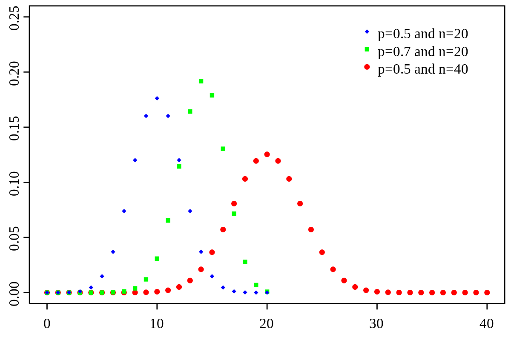

# Probability Thoery

The reason we study statistics and probability together is because when we collect data as part of a statistical study, we want to be able to use what we know about probability to say how likely it is that our results are reliable.

Probability is how likely it is that something will occur. You can write a probability as a fraction, decimal or percent, but all probabilities are numbers equal to or between 0 and 1.

The formula:

$$
P(event) = \frac{\text{outcomes that meet our criteria}}{\text{all possible outcomes (also: sample space)}}
$$

Example:

How likely is it to draw a queen from a deck of playing cards? First, how many outcomes or cards meet our criteria? Four. How many possible outcomes are there? A card deck has 52 cards.

$$
P(queen) = \frac{4}{52}=0.07692307692≈7.7 \%
$$

For example, let's say we flip a coin four times in a row. As you know, it's completely possible that, just by chance, we end up with four heads in a row. Based on that result, we might say that the probability of getting heads is

$$
P(heads) = \frac{4}{4}= 1 = 100 \%
$$

But how can this be true? Before we saw that the probability of getting heads on one flip was 50 % , but now we're calculating the probability of getting heads four times in a row at 100 % . What's going on?

We're looking at the difference between experimental and theoretical probability. Experimental probability (also called **empirical probability**) is the probability we find when we run experiments, basically the results of an experiment. If we flip the coin a fifth time and get tails this time, then the experimental probability of getting heads after 5 experiments is

$$
P(heads) = \frac{4}{5}= 80\%
$$

In other words, the experimental probability of an event will be constantly changing as we run more and more experiments over time. If the experiment is a good one, the idea is that over time the experimental probability will get very close to the theoretical probability.

Theoretical probability (also called classical probability) is the probability that an event will occur if you could run an infinite number of experiments. Or, you can think about the theoretical probability as the one we get from the simple probability formula:

$$
P(event) = \frac{\text{outcomes that meet our criteria}}{\text{all possible outcomes}}
$$

We know from using this formula that the probability of getting heads when we flip a coin is 50 % . Therefore, the theoretical probability is 50 % , which means that the more experiments we run, the closer our experimental probability should get to 50 % .

This is also called the **law of large numbers**. It says that, if we could run an infinite number of experiments, that our experimental probability would eventually equal our theoretical probability.

## Conditional Probability

Bayes' theorem or condtional probability **describes the probability of an event, based on prior knowledge of conditions that might be related to the event.** For example, if the risk of developing health problems is known to increase with age, Bayes' theorem allows the risk to an individual of a known age to be assessed more accurately (by conditioning it on their age) than simply assuming that the individual is typical of the population as a whole.

Bayes' theorem is also called Bayes' Rule or Bayes' Law and is the foundation of the field of Bayesian statistics.

Bayes' theorem is stated mathematically as the following equation:

$$
P(A|B)=\frac{P(B|A)*P(A)}{P(B)}
$$

Which tells us:

-   how often $A$ happens *given that* $B$ *happens*, written $P(A|B)$.

When we know:

-   how often $B$ happens *given that* $A$ *happens,* written $P(B|A)$.

-   how likely $A$ is on its own, written $P(A)$.

-   how likely $B$ is on its own, written $P(B)$.

**Example**

Let us say P(Fire) means how often there is fire, and P(Smoke) means how often we see smoke, then:

-   P(Fire\|Smoke) means how often there is fire when we can see smoke 

-   P(Smoke\|Fire) means how often we can see smoke when there is fire

So the formula kind of tells us "forwards" P(Fire\|Smoke) when we know "backwards" P(Smoke\|Fire)

-   dangerous fires are rare (1%), $P(Fire)$.

-   but smoke is fairly common (10%) due to barbecues, $P(Smoke)$.

-   and 90% of dangerous fires make smoke, smoke given dangerous fire, $P(Smoke|Fire)$.

We can then discover the **probability of dangerous Fire when there is (given) Smoke**:

$$
P(Fire|Smoke) = \frac{P(Smoke|Fire)*P(Fire)}{P(Smoke)}=\frac{90\%*1\%}{10\%}= 9\%
$$

So it is still worth checking out any smoke to be sure.

## Permutations

Permutations and Combinations are the **number of ways** you can **arrange** or **combine** a set of things. Permutations are used when the **order does matter**, meaning 123 is not the same as 213. In combinations the order does not matter. This is often used for questions like what's the probability to get at least 5 coin flips with head in 10 total tosses. I.e., the order of the heads in when tossing is not important, the total amount is.

There are two types of permutations (remember the **order does matter**).

### Permutations with repetition

Example: a digit lock (it could be 333). How many different ways are there to input a 3-digit lock with numbers from 0 to 9 are there?

The formula:

$$
n^r
$$

where $n$ is the number of distinct things to choose from and we choose $r$ of them.

The answer:

$$
n^r=10^3=1000
$$

### Permutations without repetition

Example 1): arrangement of 16 pool balls. You pick one ball and the next has one option less to choose from. How many different ways are there to arrange 16 distinct pool balls?

The formula:

$$
P(n,r)=\frac{n!}{(n-r)!}
$$

> Example 1) the answer:

$$
P(n,r)=\frac{n!}{(n-r)!} = P(16,16) = \frac{16!}{(16-16)!}=\frac{16!}{1}=20.922.789.888.000
$$

When we calculate **Permutations without repetition** each time we have to subtract one less option to choose from, because we've already used one distinct value. I.e. $5*4*3$ instead of $5*5*5$. This process of decrementing a value by 1 repeatedly is mathematically notated by $n! = (5-1)*(4-1)*(3-1)*(2-1)$. Because we only choose three ($r$) numbers of the set of 5 numbers we have to divide them by the excess permutations.

Example 2) How many different three letter "words" can be formed by the letters abcde?

Example 2) the answer:

$$
P(5,3)=\frac{5!}{(5-3)!}=\frac{5!}{2!}= \frac{5*4*3*2*1}{2*1}= 5*4*3=60
$$

Same as:

abc,abd,abe,acb,acd,ace,adb,adc,ade,aeb,aec,aed (12 with a first)

bac,bad,bae,.... (so 12 times 5 = 60).

## Combinations

On the other hand, a **Combination** is the number of ways you can arrange a set of things, but the order doesn't matter.

There are also two types of combinations (remember the order does **not** matter now):

### Combinations with repetitions

Example: coins in your pocket (5,5,5,10,10)

This is actually the most complicated and I haven't had the need to use it so far.

### Combinations without repetition

Example: lottery numbers (2,14,15,27). How many combinations are there in choosing 5 lottery numbers from 1 to 10?

The formula, also called the **Binomial Coefficient**:

$$
P(n,r)=\frac{n!}{r!(n-r)!}
$$

The answer:

$$
P(n,r)=\frac{n!}{r!(n-r)!}=\frac{10!}{5!(10-5)!}=\frac{10!}{5!*5!}=252
$$

Same as:

1,2,3,4,5 (counted the same as 2,1,3,4,5 and 3,1,2,4,5 etc.) - 1,2,3,4,6 - ...

## Random Variables

A variable can take at least two different values. For a random sample or randomized experiment, each possible outcome has a probability that it occurs. The variable itself is sometimes then referred to as a **random variable**. This terminology emphasizes that the outcome varies from observation to observation according to random variation that can be summarized by probabilities.

Another way to think about the concept of random variables is as placeholders for otherwise long explanations of events. For example, the notation of the probability of getting two heads in an experiment of two coin flips could be written as $P(\text{getting two heads in 2 flips})$. But if you use a variable X, usually written large, that increases by $1$ every time a flip shows a head you could write it as such: $P(X=2)$. Much neater.

### Discrete Random Variables

A variable is **discrete** if the possible outcomes are a set of separate values, such as a variable expressed as "the number of ..." with possible values 0, 1, 2, .... If you can count them.

Example: Let y denote the response to the question "What do you think is the ideal number of children for a family to have?" This is a discrete variable, taking the possible values 0, 1, 2, 3, and so forth. According to recent General Social Surveys, for a randomly chosen person in the United States the probability distribution of Y is approximately as the table shows. The table displays the recorded y-values and their probabilities. For instance, P(4), the probability that Y = 4 children is regarded as ideal, equals 0.12. Each probability in table is between 0 and 1, and the sum of the probabilities equals 1.

{width="358"}

A histogram can portray the probability distribution. The rectangular bar over a possible value of the variable has height equal to the probability of that value. The bar over the value 4 has height 0.12, the probability of the outcome 4.

{width="412"}

### Continuous Random Variables

It is **continuous** if the possible outcomes are an infinite continuum, such as all the real numbers between 0 and 1. If you can measure it. A probability distribution lists the possible outcomes and their probabilities.

Example: Commuting Time to Work A recent U.S. Census Bureau study about commuting time for workers in the United States who commute to work 2 measured y = travel time, in minutes. The probability distribution of y provides probabilities such as P(y \< 15), the probability that travel time is less than 15 minutes, or P(30 \< y \< 60), the probability that travel time is between 30 and 60 minutes.

This figure portrays the probability distribution of y. The shaded area in the figure refers to the region of values higher than 45. This area equals 15% of the total area under the curve, representing the probability of 0.15 that commuting time is more than 45 minutes. Those regions in which the curve has relatively high height have the values most likely to be observed.

{width="492"}

### Transforming Random Variables (Shift or Scale)

When transforming a random variable the corresponding metrics change depending on weather the variable is being shifted, by adding or subtracting (+k or -k) the data, or scaled, by multiplying or dividing (\*k or / k).

**Shifting**

The measures of centrality **change** by + or - k.

The measures of variability **don't change**.

**Scaling**

The measures of centrality **change** by \* or / k.

The measures of variability **change** by \* or / k.


### Expected Value (Mean)

Like a population distribution, a probability distribution has parameters describing **center** and **variability**. The **mean** describes center and the **standard deviation** describes variability. The parameter values are the values these measures would assume, in the long run, if the randomized experiment or random sample repeatedly took observations on the variable y having that probability distribution.

For example, suppose we take observations from the distribution in child number preferences. Over the long run, we expect y = 0 to occur 1% of the time, y = 1 to occur 3% of the time, and so forth. In 100 observations, for instance, we expect about:

one 0, three 1 ′ s, sixty 2 ′ s, twenty-three 3 ′ s, twelve 4 ′ s, and one 5.

In that case, since the mean equals the total of the observations divided by the sample size, the mean equals:

$$
\frac{0(1) + 1(3) + 2(60) + 3(23) + 4(12) + 5(1)}{100}=\frac{245}{100}=2.45
$$

The calculation has the form:

$$
0(0.01)+ 1(0.03) + 2(0.60) + 3(0.23) + 4(0.12) + 5(0.01)
$$

The mean of a probability distribution is also called the **expected value**. The terminology reflects that E(y) represents what we expect for the average value of y in a long series of observations.

### Standard Deviation

The standard deviation of a probability distribution, denoted by σ, measures its variability. The more spread out the distribution, the larger the value of σ. The Empirical Rule helps us to interpret σ. If a probability distribution is bell shaped, about 68% of the probability falls between μ−σ and μ + σ, about 95% falls between μ − 2σ and μ + 2σ, and all or nearly all falls between μ − 3σ and μ + 3σ.

The standard deviation σ is the square root of the variance σ² of the probability distribution. The variance measures the average squared deviation of an observation from the mean. That is, it is the expected value of (y − μ)² . In the discrete case, the formula is

$$
σ^2= E(y-μ)^2= \sum(y-μ)^2*P(y)
$$

## Normal Distribution


Early statisticians noticed the same shape coming up over and over again in different distributions, so they named it the **normal distribution**. In probability theory, a normal (or Gaussian or Gauss or Laplace-Gauss) distribution is a type of continuous probability distribution for a real-valued random variable.

The parameter μ is the mean or expectation of the distribution (and also its median and mode), while the parameter σ is its standard deviation. The variance of the distribution is σ². Their importance is partly due to the central limit theorem. It states that, under some conditions, the average of many samples (observations) of a random variable with finite mean and variance is itself a random variable - whose distribution converges to a normal distribution as the number of samples increases.

### Properties

Normal distributions have the following features: - symmetric bell shape - mean and median are equal, both located at the center of the distribution - ≈ 68% of the data falls within 1 standard deviation of the mean - ≈ 95% of the data falls within 2 standard deviation of the mean - ≈ 99.7% of the data falls within 3 standard deviation of the mean


For example, heights of adult females in North America have approximately a normal distribution with μ = 65.0 inches and σ = 3.5. The probability is nearly 1.0 that a randomly selected female has height between μ − 3σ = 65.0 − 3(3.5) = 54.5 inches and μ + 3σ = 65.0 + 3(3.5) = 75.5 inches. Adult male height has a normal distribution with μ = 70.0 and σ = 4.0 inches. So, the probability is nearly 1.0 that a randomly selected male has height between μ − 3σ = 70.0 − 3(4.0) = 58 inches and μ + 3σ = 70.0 + 3(4.0) = 82 inches.


### Z-Scores

In statistics, the standard score is the number of standard deviations by which the value of a raw score (i.e., an observed value or data point) is above or below the mean value of what is being observed or measured. Raw scores above the mean have positive standard scores, while those below the mean have negative standard scores.

It is calculated by subtracting the population mean from an individual raw score and then dividing the difference by the population standard deviation. This process of converting a raw score into a standard score is called standardizing or normalizing (however, "normalizing" can refer to many types of ratios; see normalization for more).

Standard scores are most commonly called z-scores; the two terms may be used interchangeably, as they are in this article. Other terms include z-values, normal scores, and standardized variables.

Computing a z-score requires knowing the mean and standard deviation of the complete population to which a data point belongs; if one only has a sample of observations from the population, then the analogous computation with sample mean and sample standard deviation yields the t-statistic.

A z-score measures exactly how many standard deviations above or below the mean a data point is.

Here is the formula:

$$
z = \frac{\text{data point - mean}}{\text{standard deviation}}
$$

Here is the same formula written with symbols:

$$
z = \frac{x-μ}{σ}
$$

Here are some important facts about z-scores:

1.  A positive z-score says the data point is above average.
2.  A negative z-score says the data point is below average.
3.  A z-score close to 0 says the data point is close to average.
4.  A data point can be considered unusual if its z-score is above 3 or below − 3.

**Example**

The grades on a history midterm at Almond have a mean of\
μ = 85 and a standard deviation of σ = 2.

Michael scored 86 on the exam. Find the z-score for Micheal's exam grade.

$$
z = \frac{\text{his grade - mean grade}}{\text{standard deviation}}
$$

$$
z = \frac{86-85}{2}=\frac{1}{2}=0.5
$$

Micheal's z-score is 0.5 point. His grade was half of a standard deviation above the mean.

### Examples

#### Finding Percentages

Example: a certain variety of tree has a mean trunk diameter of μ = 150 cm and a standard deviation of σ = 30cm.

**Approximately what percent of these trees have a diameter greater than 210 cm?**

**Solution:**

**Step 1:** Sketch a normal distribution with a mean of μ = 150 cm and a standard deviation of σ = 30 cm.

**Step 2:** The diameter of 210 cm is two standard deviations above the mean. Shade above that point.

**Step 3**: Add the percentages in the shaded area:


$$
2.35+0.15 = 2.5\text{%}
$$

About 2.5% of these trees have a diameter greater than 210 cm.

#### Expected Value

Example: a certain variety of pine tree has a mean trunk diameter of μ = 150 cm and a standard deviation of σ = 30 cm. A certain section of a forest has 500 of these trees.

Approximately how many of these trees have a diameter smaller than 120 cm?

**Solution:**

**Step 1:** Sketch a normal distribution with a mean of [μ]{.ul} = 150 cm and a deviation of σ = 30 cm.

**Step 2:** The diameter of 120 cm is one standard deviation below the mean. Shade below that point.

**Step 3:** Add the percentage in the shaded area:\
\

$$
0.15+2.35+13.5=16\%
$$

About 16 % of these trees have a diameter smaller than 120 cm.

**Step 4: Find how many trees in the forest that percent represents.**

We need to find how many trees 16 % of 500 is.

$$
16\% \text{ of }500=0.16*500=80
$$

About 80 trees have a diameter smaller than 120 cm.

### In R

The `pnorm()` function in R accepts a z-value/standard deviation value and returns the cumulative probability below that value. The `qnorm()` function returns the z-value/standard deviation value from a probabilty.

``` r
pnorm(q, mean = 0, sd = 1, lower.tail = TRUE, log.p = FALSE)
qnorm(p, mean = 0, sd = 1, lower.tail = TRUE, log.p = FALSE)
```

#### Calculate Probability From Z-Value

If you have the standard deviation or z-value and want to find out the probability.

**Example 1**\
The height of middle school students is normally distributed with a mean of 150 cm and a standard deviation of 20 cm. What is the probability that randomly selected students have a height greater than 170 cm, denoted by the random variable X.

In our example we need the cumulative probability above that value (the right side of the curve) and therefore need to subtract the function value from 1.

```{r}
1-pnorm(1)
```

Or even more elaborate using all parameters in the `pnorm()` function.

```{r}
pnorm(q = 170, mean = 150, sd = 20, lower.tail = F)
```

Answer: the probability of student randomly selected with a height above 170 cm, i.e. above one standard deviation from the mean, is 15.9 %.

**Example 2**\
A set of middle school student heights are normally distributed with a mean of 150 cm and a standard deviation of 20 centimeters. Let X = the height of a randomly selected student from this set.

Find out: $P(140 < X < 154)$.

Step 1: Find out the left tail probability for X below 154 cm: 0.58.

Step 2: Find out the left tail probability for X below 140 cm: 0.31.

Step 3: To find out the probability for in between X \< 154 and X \> 140 subtract the first from the latter.

```{r}
pnorm(q = 154, mean = 150, sd = 20, lower.tail = T) - pnorm(q = 140, mean = 150, sd = 20, lower.tail = T)
```

Answer: the probability for a randomly selected student to have a height between 140 and 154 cm is 31 %.

**Find probabilities if you have a z-value** For the left-tail/cumulative probabilities, i.e. mean - z x standard deviation, in a normal distribution. Calculate it by a specific z value.

```{r}
pnorm(2) # cumulative probability below mu + 2.0(sigma)
pnorm(-1) # The P() of falling below the sd of -1.
```

To find the right-tail probabilities for a specific z value in a normal distribution subtract it from 1.

```{r}
1-pnorm(2) # The P() of falling over the sd of 2.
1-pnorm(-1)# The P() of falling over the sd of -1.
```

The probability of falling within 2 standard deviations of the mean:

```{r}
1 - 2 * pnorm(-2)
```

Show that 90% of a normal probability distribution falls between mean - 1.64 and mean + 1.64.

```{r}
1 - 2 * (pnorm(1.64))
```

#### Calculate Z-Value From Probability

If, one the other hand, you have the probability for an event and want to find out the z-value or standard deviation you can use the `qnorm()` function. `qnorm()` accepts a probability of a normal distribution and return the z-value associated with said probability. Notice that `qnorm()` also return the left side of the distribution. If you need the right side simply put a minus in front.

```{r}
qnorm(0.1586)
-qnorm(0.1586)
```

**Find z-value if you have a probability**\
To the the z-values corresponding to specific probability values we can use this.

```{r}
qnorm(0.975) # q denotes "quantile"; .975 quantile = 97.5 percentile
# The z-value is 1.96, rounded to two decimals
```

More checks.

```{r}
qnorm(.05)
qnorm(0.01)
# To get the right-tail probability.
-qnorm(0.005)

```

## Binomial Distribution



In probability theory and statistics, the binomial distribution with parameters n and p is the discrete probability distribution of the number of successes in a sequence of n independent experiments, each asking a yes--no question, and each with its own Boolean-valued outcome: success (with probability p) or failure (with probability q = 1 − p). A single success/failure experiment is also called a Bernoulli trial or Bernoulli experiment, and a sequence of outcomes is called a Bernoulli process; for a single trial, i.e., n = 1, the binomial distribution is a Bernoulli distribution. The binomial distribution is the basis for the popular binomial test of statistical significance.

The binomial distribution is frequently used to model the number of successes in a sample of size n drawn with replacement from a population of size N. If the sampling is carried out without replacement, the draws are not independent and so the resulting distribution is a hypergeometric distribution, not a binomial one. However, for N much larger than n, the binomial distribution remains a good approximation, and is widely used.

### Expected Value (Mean) and Variance

If X \~ B(n, p), that is, X is a binomially distributed random variable, n being the total number of experiments and p the probability of each experiment yielding a successful result, then the expected value of X is:

$$
E(X)=np
$$

This follows from the linearity of the expected value along with fact that *X* is the sum of *n* identical Bernoulli random variables, each with expected value *p*. In other words, if $X_1,...,X_n$ are identical (and independent) Bernoulli random variables with parameter *p*, then $X=X_1+…+X_n$ and $E(X)=E[X_1+...+X_n]=E(X_1)+...+E(X_n)=p+...p=np$

The variance is:

$$
Var(X)=np(1-p)
$$

This similarly follows from the fact that the variance of a sum of independent random variables is the sum of the variances.

### In R

**Example**

Suppose there are twelve multiple choice questions in an English class quiz. Each question has five possible answers, and only one of them is correct. Find the probability of having four or less correct answers if a student attempts to answer every question at random.

**Answer**

Since only one out of five possible answers is correct, the probability of answering a question correctly by random is 1/5=0.2. We can find the probability of having exactly 4 correct answers by random attempts as follows.

We use the `dbinom()` function for a single successful outcome, e.g. $r=4$, and `pbinom()` for cumulative successful outcomes, e.g. $r<=4$.

```{r}
dbinom(x = 4, size = 12, prob = 0.2)
```

The probability for 4 successful outcomes or less.

```{r}
pbinom(4, 12, 0.2)
```

## Bernoulli Distribution

The Bernoulli distribution is a **special case of the binomial distribution** where a **single trial** is conducted (so n would be 1 for such a binomial distribution). It is also a special case of the **two-point distribution**, for which the possible outcomes need not be 0 and 1.

In probability theory and statistics, the **Bernoulli distribution** is the discrete probability distribution of a random variable which takes the value $1$ with probability $p$ and the value $0$ with probability $q = 1 −p$. Less formally, it can be thought of as a model for the set of possible outcomes of any single experiment that asks a yes--no question. Such questions lead to outcomes that are **boolean-valued**: a single bit whose value is success/yes/true/one with probability p and failure/no/false/zero with probability $q$. It can be used to represent a (possibly biased) coin toss where 1 and 0 would represent "heads" and "tails" (or vice versa), respectively, and p would be the probability of the coin landing on heads or tails, respectively. In particular, unfair coins would have $p ≠ 1/2$.

### Properties

If $X$ is a random variable with this distribution, then:

$$
Pr(X=1)=p=1-Pr(X=0)=1-q
$$

\
The Bernoulli distribution is a special case of the binomial distribution with $n=1$.

### Mean

The expected value of a Bernoulli random variable X is

$$
E(X) = p
$$

This is due to the fact that for a Bernoulli distributed random variable $X$ with $Pr(X=1)=p$ and $Pr(X=0)=q$ we find

$$
E(X)=Pr(X=1)*1+Pr(X=0)*0=p*1+q*0=p
$$

### Variance

The variance of a Bernoulli distributed X is

$$
Var(X)=pq=p(1-p)
$$

We first find

$$
E(X^2)=Pr(X=1)*1^2+Pr(X=0)*0^2=p*1^2+q*0^2=E(X)
$$

From this follows

$$
Var(X)=E(X^2)-E(X)^2=E(X)-E(X)^2=p-p^2=p(1-p)=pq
$$

With this result it is easy to prove that, for any Bernoulli distribution, its variance will have a value between $0$ and $1/4$.

### In R

The required package for Bernoulli operations in R is called `Rlab`.

Density, distribution function, quantile function and random generation for the Bernoulli distribution with parameter **`prob`**.

```{r}
Rlab::dbern(x = 3, prob = .5)


```

## Geometric Distribution

In probability theory and statistics, the **geometric distribution** is either one of **two discrete probability distributions**:

-   The probability distribution of the number X of Bernoulli trials needed to get one success, supported on the set { 1, 2, 3, ... }
-   The probability distribution of the number Y = X − 1 of failures before the first success, supported on the set { 0, 1, 2, 3, ... }

Which of these one calls "the" geometric distribution is a matter of convention and convenience.

These two different geometric distributions should not be confused with each other. Often, the name shifted geometric distribution is adopted for the former one (distribution of the number X); however, to avoid ambiguity, it is considered wise to indicate which is intended, by mentioning the support explicitly.

The geometric distribution gives the probability that the first occurrence of success requires *k* independent trials, each with success probability *p*. If the probability of success on each trial is *p*, then the probability that the *k*th trial (out of *k* trials) is the first success is

$$
Pr(X=k)=(1-p)^{k-1}p
$$

for *k* = 1, 2, 3, ....

The above form of the geometric distribution is used for modeling the number of trials up to and including the first success. By contrast, the following form of the geometric distribution is used for modeling the number of failures until the first success:

$$
Pr(Y=k)=Pr(X=k+1)=(1-p)^kp
$$

for *k* = 0,1,2,3, ...

In either case, the sequence of probabilities is a geometric sequence.

For example, suppose an ordinary die is thrown repeatedly until the first time a "1" appears. The probability distribution of the number of times it is thrown is supported on the infinite set { 1, 2, 3, ... } and is a geometric distribution with p = 1/6.

The geometric distribution is denoted by Geo(p) where 0 \< p ≤ 1.

Consider a sequence of trials, where each trial has only two possible outcomes (designated failure and success). The probability of success is assumed to be the same for each trial. In such a sequence of trials, the geometric distribution is useful to model the number of failures before the first success. The distribution gives the probability that there are zero failures before the first success, one failure before the first success, two failures before the first success, and so on.

**When is the geometric distribution an appropriate model?**\
The geometric distribution is an appropriate model if the following assumptions are true.

-   The phenomenon being modeled is a sequence of independent trials.
-   There are only two possible outcomes for each trial, often designated success or failure.
-   The probability of success, p, is the same for every trial.

If these conditions are true, then the geometric random variable Y is the count of the number of failures before the first success. The possible number of failures before the first success is 0, 1, 2, 3, and so on. In the graphs above, this formulation is shown on the right.

An alternative formulation is that the geometric random variable X is the total number of trials up to and including the first success, and the number of failures is *X* − 1. In the graphs above, this formulation is shown on the left.\

### In R

**Not sure if those are all correct!**

R function `dgeom()` calculates the probability of `x` failures prior to the first success.

Example: I pick cards from a standard deck until I get a king (I replace the cards if they are not a king). What is the probability that I need to pick 5 cards, i.e. I pick 4 unsuccessful cards (x=4) and the fifth is a success.

```{r}
dgeom(x= 4,prob = 1/13)
```

The function `pgeom()` is the cumulative probability of less than or equal to q failures prior to success.

Example 1: What is the probability that I pick less than 10 cards?

```{r}
pgeom(q = 9, prob = 1/13, lower.tail = F)
```

Example 2: What is the probability that I need to pick more than 12 cards?

```{r}
1-pgeom(q = 13, prob = 1/13, lower.tail = F)
```
