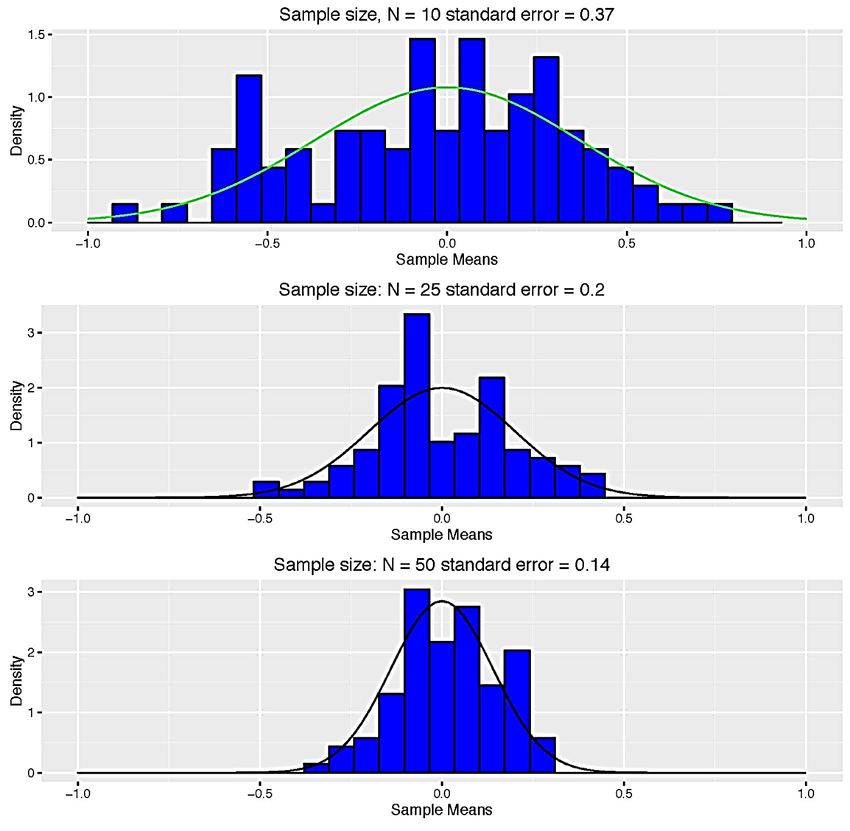
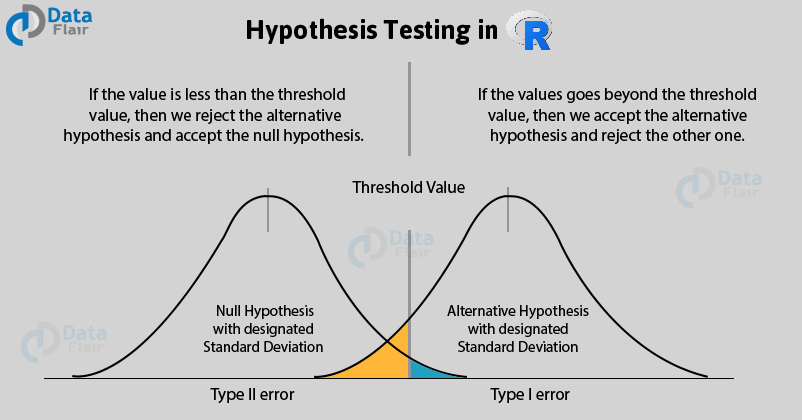
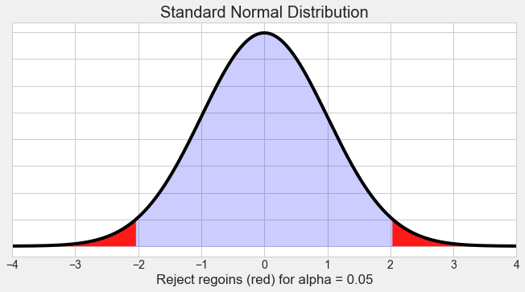

# Inferential Statistics

To draw meaningful conclusions about the entire population, **inferential statistics** is needed. It uses patterns in the sample data to draw **inferences about the population** represented while **accounting for randomness.** These inferences may take the form of answering yes/no questions about the data (**hypothesis testing**), estimating numerical characteristics of the data (**estimation**), describing associations within the data (**correlation**), and modeling relationships within the data (for example, using **regression analysis**). Inference can extend to **forecasting**, **prediction**, and **estimation** of unobserved values either in or associated with the population being studied. It can include extrapolation and interpolation of time series or spatial data, and data mining.

## Sampling Distributions

A sampling distribution refers to a probability distribution of a statistic that comes from choosing random samples of a given population. Also known as a finite-sample distribution, it represents the distribution of frequencies on how spread apart various outcomes will be for a specific population.

{width="802"}

**1. Sampling distribution of mean**

As shown from the example above, you can calculate the mean of every sample group chosen from the population and plot out all the data points. The graph will show a normal distribution, and the center will be the mean of the sampling distribution, which is the mean of the entire population.

**2. Sampling distribution of proportion**

It gives you information about proportions in a population. You would select samples from the population and get the sample proportion. The mean of all the sample proportions that you calculate from each sample group would become the proportion of the entire population.

**3. T-distribution**

T-distribution is used when the sample size is very small or not much is known about the population. It is used to estimate the mean of the population, confidence intervals, statistical differences, and linear regression.

## Central Limit Theorem


The Central Limit Theorem (CLT) tells us that when the number of draws, also called the *sample size*, is large, the probability distribution of the sum of the independent draws is approximately normal. Because sampling models are used for so many data generation processes, the CLT is considered one of the most important mathematical insights in history.

### What is Large Enough for the CTL?

The CLT works when the number of draws is large. But large is a relative term. In many circumstances as few as 30 draws is enough to make the CLT useful. In some specific instances, as few as 10 is enough. However, these should not be considered general rules. Note, for example, that when the probability of success is very small, we need much larger sample sizes.

By way of illustration, let's consider the lottery. In the lottery, the chances of winning are less than 1 in a million. Thousands of people play so the number of draws is very large. Yet the number of winners, the sum of the draws, range between 0 and 4. This sum is certainly not well approximated by a normal distribution, so the CLT does not apply, even with the very large sample size. This is generally true when the probability of a success is very low. In these cases, the Poisson distribution is more appropriate.

### Proof of Central Limit Theorem

Let's create a sampling model and calculate a random statistic for the proportion p.

```{r}
n = 100
p = 0.4

x = sample(c(1,0), size = n, replace = T, prob = c(p, (1-p)))
x_bar= mean(x)
x_bar
```

Now let's create a Monte Carlo simulation in which we calculate the sample statistic p 10,000 times.

```{r}
B = 10000
x_bar_distribution = replicate(B, {
  x = sample(c(1,0), size = n, replace = T, prob = c(p, (1-p)))
  mean(x)
})
head(x_bar_distribution)
```

The Central Limit Theorem tells us that when the number of draws, also called the *sample size*, is large, the probability distribution of the sum (or mean/proportion) of the independent draws is approximately normal. Let's test that by plotting a histogram and checking with `qqnorm()`.

```{r}
hist(x_bar_distribution) #  Looks good
qqnorm(x_bar_distribution);qqline(x_bar_distribution) # Looks good enoguh.
```

What's the practical use of this proof? Because of it we can now use the normal distribution function to calculate probabilities. What is the probability that we get a proportion that is smaller than ? We first need the calculate the standard error of our sample.

```{r}
SE = sqrt(p * (1-p) / n)
3 * SE
```

The sampling distribution of the sample proportion is approximately normal and normal distributions encompass almost all possible values within 3 standard deviations from the mean. We can therefore say that 99.7 % of all samples proportion statistics for n = 100 and p = 0.4 fall within +- 0.147 of 0.4. Here is the proof. We can compare the results from Monte Carlo simulation sampling distribution with standard normal distribution function. I.e. what's the proportions/probability of falling outside of 3 standard deviations from the mean?

```{r}
mean(x_bar_distribution < p - 3 * SE) + mean(x_bar_distribution > p + 3 * SE)
pnorm(-3) + 1 - pnorm(3)

```

This does in fact check out! The proportions from the Monte Carlo simulation and the probabilities from the normal distribution function do approximate each other very well. The applications based on these insights alone are somewhat limited.

In real life we rarely have the probabilities for the population parameters. The power does show itself however when making inferences from one single sample, its proportion statistic and its standard deviation, about the population parameter. This is because we now know (experimentally proven) that the sampling distribution of the sample proportion is normally distributed.

## Confidence Intervals

A confidence interval (abbreviated CI) is used for the purpose of estimating a population parameter (a single number that describes a population) by using statistics (numbers that describe a sample of data). For example, you might estimate the average household income (parameter) based on the average household income from a random sample of 1,000 homes (statistic). However, because sample results will vary, you need to add a measure of that variability to your estimate. This measure of variability is called the margin of error, the heart of a confidence interval. Your sample statistic, plus or minus your margin of error, gives you a range of likely values for the parameter --- in other words, a confidence interval.

**How do we do it?**

To estimate a parameter with a confidence interval:

1.  Choose your confidence level and your sample size.

2.  Select a random sample of individuals from the population.

3.  Collect reliable and relevant data from the individuals in the sample.

4.  Summarize the data into a statistic (for example, a sample mean or proportion).

5.  Calculate the margin of error. $\pm z^{*} \frac{\sigma}{\sqrt{n}}$

6.  Take the statistic plus or minus the margin of error to get your final estimate of the parameter: $\bar{x} \pm z^{*} \frac{\sigma}{\sqrt{n}}$

### Why Confidence Intervals Work

What do we know so far and how does it help with confidence intervals?

-   CLT: If $n$ is large enough, the sampling distribution of sample statistics (mean, proportion) approximates a normal distribution -> we can use Z-Scores or T-Scores to calculate probabilities.

-   The mean/proportion of the sampling distribution of the sample means/proportions is equal to the true population mean/proportion $\mu_\hat{x} = \mu$ or $p_\hat{x} = p$ ->

-   

$$
\sigma_{\bar{x}}=\frac{\sigma}{\sqrt{n}}
$$


Since the sample proportion $\hat{\pi}$ is a sample mean, the Central Limit Theorem applies: For large random samples, the sampling distribution of $\hat{\pi}$ is approximately normal about the parameter $\pi$ it estimates.

This means that each sample proportion, in the graphic below annotated with $\hat{\pi}$, has a


The confidence interval is the range of values that you expect your estimate to fall between a certain percentage of the time if you run your experiment again or re-sample the population in the same way. 

The confidence level is the percentage of times you expect to reproduce an estimate between the upper and lower bounds of the confidence interval, and is set by the alpha value.


**Confidence**, in statistics, is another way to describe probability. For example, if you construct a confidence interval with a 95% confidence level, you are confident that 95 out of 100 times the estimate will fall between the upper and lower values specified by the confidence interval.

Your desired confidence level is usually one minus the alpha ( *a* ) value you used in your statistical test:

**Confidence level** = 1 − *a*

So if you use an alpha value of *p* \< 0.05 for statistical significance, then your confidence level would be 1 − 0.05 = 0.95, or 95%.

### Proof for Confidence Intervals

#### CI for Population Proportion

Let's say we want to estimate the population proportion (the mean of a categorical variable) e.g., the proportion of votes a Democratic candidate gets in an election. In our example, the true population proportion p = 0.45. In real life we actually don't know this parameter.

In R we can create a Monte Carlo Simulation (creating confidence intervals 10,000 times) in order to prove the validity of confidence intervals in general.

```{r}
p = 0.45
n = 1000
B = 10000

set.seed(1)
correct_list = replicate(B, {
  x = sample(c(1,0), size = n, replace = T, prob = c(p, (1-p)))
  x_hat = mean(x)
  se_hat = sqrt(x_hat * (1 - x_hat) / n)
  between(p, x_hat - 1.96 * se_hat, x_hat + 1.96 * se_hat)
})
```

And how often did we get a confidence interval that did in fact include the real population parameter p? The confidence interval did include the true parameter 0.9482 of the time. Pretty close to the theoretical goal of 0.95!

```{r}
mean(correct_list)
```

Let's visualize the validity of CIs with another 100 samples and ggplot2.

```{r}
# Used to create the graph
lower_bounds = c()
upper_bounds = c()
x_hats = c()
true = c()

# Small Monte Carlo simulation
for (i in 1:100) {
  x = sample(c(1,0), size = n, replace = T, prob = c(p, (1-p)))
  x_hat = mean(x)
  x_hats = c(x_hats, x_hat)
  se_hat = sqrt(x_hat * (1 - x_hat) / n)
  lower_bounds = c(lower_bounds, (x_hat - 1.96 * se_hat))
  upper_bounds = c(upper_bounds, (x_hat + 1.96 * se_hat))
  true = c(true, between(p, x_hat - 1.96 * se_hat, x_hat + 1.96 * se_hat))
}

# ggplot2 only accepts tables
table = tibble(x_hats, lower_bounds, upper_bounds, true)

# Graph highlighting the validity of a 95% CI
ggplot(table, aes(seq_along(x_hats), x_hats)) + 
  geom_pointrange(aes(ymin = lower_bounds, ymax = upper_bounds, color = true)) +
  geom_hline(yintercept = 0.45)
```

The proof from our 10,000 confidence intervals above that did in fact capture the true population proportion $p$ (0.45) in approximately 95% of the time (0.943) tells us that we can create confidence intervals from a single sample "with confidence". In other words, we can in fact be sure that a 95% confidence interval constructed from our sample $\hat{x}$ does include $p$ in 95% of the time.

Here is a single sample from which we will create a 95% confidence interval to showcase a more real-life example.

```{r}
# In real life this model is shrouded in unknowns
x = sample(c(1,0), size = 1000, replace = T, prob = c(p, (1-p)))

# Sample mean
x_hat = mean(x)

# Standard Error
se_hat = sqrt(x_hat * (1 - x_hat) / n)

# Creating the bounds of the CI
lower_bounds = x_hat - 1.96 * se_hat
upper_bounds =x_hat + 1.96 * se_hat

# The confidence interval is:
lower_bounds
upper_bounds
```

The confidence interval did in fact capture the true population parameter, which is actually unknown. So the actual result would be expressed as follows:

> We are 95% confident that the true population proportion is between 0.404 and 0.465.

#### CI for Population Mean

Lets say we a population of monthly incomes that is totally random and non-normally distributed.

```{r}
set.seed(1)

# Create 10000 random "incomes"
incomes = runif(10000, min = 800, max = 6000)

# Peek at it
head(incomes, 10)

# Create true population mean (unknown in real life)
mu = mean(incomes)
mu

# Plot reveals its very much unnormal
plot(density(incomes))
```

Now comes the confidence interval. The parent population is very much non-normal, but because of the CTL and random sampling we can assume an approximately normal distribution of the sampling distribution of the sample means. Further, we do not replace picks when sampling (just like in real life), but can still assume independence because the sample size of 100 is only 1% from the total population of 10,000.

```{r}
# Sample
x = sample(incomes, 100)

# Sample mean
x_hat = mean(x)

# Sample standard error
se_hat = sd(x) / sqrt(100)

# Create the margin of error
lower_bound = x_hat - 1.96 * se_hat
upper_bound = x_hat + 1.96 * se_hat
ci = c(lower_bound, upper_bound)

# Here is our confidence interval
ci

# Here is the real population mean (unknown in real life)
mu
```

Result: The 95% confidence interval for the true population mean $\mu$ is 3212.27 to 3816.358 (sample mean is 3514.314).

```{r}
t.test(x, conf.level = 0.95)$conf.int
```

## Hypothesis Testing



Hypothesis testing is a form of statistical inference that uses data from a sample to draw conclusions about a population parameter or a population probability distribution. First, a tentative assumption is made about the parameter or distribution. This assumption is called the null hypothesis and is denoted by $H_0$. An alternative hypothesis (denoted $H_a$), which is the opposite of what is stated in the null hypothesis, is then defined. The hypothesis-testing procedure involves using sample data to determine whether or not $H_0$ can be rejected. If $H_0$ is rejected, the statistical conclusion is that the alternative hypothesis $H_a$ is true.

### P-Value

We can think of a P-value as a conditional probability: given the null hypothesis is true, what's the probability of obtaining a sample statistic as extreme or more than the one observed by random chance alone. In this type of test, we use the alternative hypothesis $H_{\mathrm{a}}$ to decide if the P-value comes from the probability above the test statistic, below the test statistic, or comes from a two-sided probability.

{width="600"}

### Z-Test



### Formula: z test statistic

We can calculate the test statistic corresponding to the sample result:

$$
z=\frac{\text { statistic - parameter }}{\text { standard deviation of statistic }}
$$

$$
=\frac{\hat{p}-p_{0}}{\sqrt{\frac{p_{0}\left(1-p_{0}\right)}{n}}}
$$

(where $\hat{p}$ is the sample proportion, $p_{0}$ is the proportion from the null hypothesis, and $n$ is the sample size).

### R: P-value from z-score

**R Function**

To find the p-value associated with a z-score in R, we can use the pnorm() function, which uses the following syntax:

**`pnorm(q, mean = 0, sd = 1, lower.tail = TRUE)`**

where:

-   **q:** The z-score

-   **mean:** The mean of the normal distribution. Default is 0.

-   **sd:** The standard deviation of the normal distribution. Default is 1.

-   **lower.tail:** If TRUE, the probability to the left of **q** in the normal distribution is returned. If FALSE, the probability to the right is returned. Default is TRUE.

**Example 1: one-sided**

In 2011, $51 \%$ of cell phone owners in a country reported that their cell phone was a smartphone. The following year, the researchers wanted to test $H_{0}: p=0.51$ versus $H_{\mathrm{a}}: p>0.51$, where $p$ is the proportion of cell phone owners in that country who have a smartphone.

They surveyed a random sample of 934 cell phone owners in that country and found that 501 of them had a smartphone. The test statistic for these results was $z \approx 1.61$.

What is the P-Value?

```{r}
pnorm(1.61, lower.tail = F)
```

P-Value Answer: 0.054

**Example 2: two-sided**

Amanda read a report saying that $49 \%$ of teachers in the United States were members of a labor union. She wanted to test whether this was true in her state, so she took a random sample of 300 teachers from her state to test $H_{0}: p=0.49$ versus $H_{\mathrm{a}}: p \neq 0.49$, where $p$ is the proportion of teachers in her state who are members of a labor union.

The sample results showed 134 teachers were members of a labor union, and the corresponding test statistic was $z \approx-1.50$.

What is the P-Value?

```{r}
2*pnorm(-1.5)
```

P-Value Answer: 0.133

### Conditions for mean inference

When we want to carry out inference (build a confidence interval or do a significance test) on a mean, the accuracy of our methods depends on a few conditions. Before doing the actual computations of the interval or test, it's important to check whether or not these conditions have been met. Otherwise the calculations and conclusions that follow may not be correct.

The conditions we need for inference on a mean are:

-   **Random**: A random sample or randomized experiment should be used to obtain the data.

-   **Normal**: The sampling distribution of $\overline{x}$ (the sample mean) needs to be approximately normal. This is true if our parent population is normal or if our sample is reasonably large $(n\geq 30)$.

-   **Independent**: Individual observations need to be independent. If sampling without replacement, our sample size shouldn't be more than $10\%$ of the population.

Let's look at each of these conditions a little more in-depth.

**The random condition**

Random samples give us unbiased data from a population. When we don't use random selection, the resulting data usually has some form of bias, so using it to infer something about the population can be risky.

> For example, suppose a university wants to report the average starting salary of their graduates. How do they obtain the data? They can't access the salaries of all graduates, and they can't realistically get salaries from a random sample of graduates. The university could rely on graduates who are willing to share their salaries to calculate the average, but using voluntary response will likely lead to a biased estimate of the true average. Graduates with higher starting salaries will probably be more willing to report their salaries than graduates with low salaries (or graduates without salaries). Also, graduates who participate may claim their salary is higher than it really is, but they'd be unlikely to say it's lower than it really is.
>
> *The big idea is that data that came from a non-random sample may not be representative of its population.*\

More specifically, sample means are unbiased estimators of their population mean. For example, suppose we have a bag of ping pong balls individually numbered from 0 to 30, so the population mean of the bag is 15. We could take random samples of balls from the bag and calculate the mean from each sample. Some samples would have a mean higher than 15 and some would be lower. But on average, the mean of each sample will equal 15. We write this property as $\mu_{\bar{x} } =\mu$, which holds true as long as we are taking random samples.

This won't necessarily happen if we use a non-random sample. Biased samples can lead to inaccurate results, so they shouldn't be used to create confidence intervals or carry out significance tests.

**The normal condition**

The sampling distribution of $\bar{x}$ (a sample mean) is approximately normal in a few different cases. The shape of the sampling distribution of $\bar{x}$ mostly depends on the shape of the parent population and the sample size n.

**Case 1: Parent population is normally distributed**

If the parent population is normally distributed, then the sampling distribution of $\bar{x}$ is approximately normal regardless of sample size. So if we know that the parent population is normally distributed, we pass this condition even if the sample size is small. In practice, however, we usually don't know if the parent population is normally distributed.

**Case 2: Not normal or unknown parent population; sample size is large** $(n \geq 30)$

The sampling distribution of $\bar{x}$ is approximately normal as long as the sample size is reasonably large. Because of the central limit theorem, when $n \geq 30$, we can treat the sampling distribution of $\bar{x}$ as approximately normal regardless of the shape of the parent population.

There are a few rare cases where the parent population has such an unusual shape that the sampling distribution of the sample mean $\bar{x}$ isn't quite normal for sample sizes near 30. These cases are rare, so in practice, we are usually safe to assume approximately normality in the sampling distribution when $n \geq 30$.

**Case 3: Not normal or unknown parent population; sample size is small** $n<30$

As long as the parent population doesn't have outliers or strong skew, even smaller samples will produce a sampling distribution of $\bar{x}$ that is approximately normal. In practice, we can't usually see the shape of the parent population, but we can try to infer shape based on the distribution of data in the sample. If the data in the sample shows skew or outliers, we should doubt that the parent is approximately normal, and so the sampling distribution of $\bar{x}$ may not be normal either. But if the sample data are roughly symmetric and don't show outliers or strong skew, we can assume that the sampling distribution of $\bar{x}$ will be approximately normal.

*The big idea is that we need to graph our sample data when* $n < 30$, is less than, 30 and then make a decision about the normal condition based on the appearance of the sample data.

**The independence condition**

To use the formula for standard deviation of $\bar{x}$ we need individual observations to be independent. In an experiment, good design usually takes care of independence between subjects (control, different treatments, randomization).

In an observational study that involves sampling without replacement, individual observations aren't technically independent since removing each observation changes the population. However the 10% condition says that if we sample 10% or less of the population, we can treat individual observations as independent since removing each observation doesn't change the population all that much as we sample. For instance, if our sample size is $n=30$ there should to be at least $N = 300$ members in the population for the sample to meet the independence condition.

Assuming independence between observations allows us to use this formula for standard deviation of $\bar{x}$ when we're making confidence intervals or doing significance tests:

$$
\sigma_{\bar{x}}=\frac{\sigma}{\sqrt{n}}
$$

We usually don't know the population standard deviation $\sigma$, so we substitute the sample standard deviation $s_x$ as an estimate for $\sigma$. When we do this, we call it the **standard error** of $\bar{x}$ to distinguish it from the standard deviation.

So our formula for standard error of $\bar{x}$ is:

$$
\sigma_{\bar{x}} \approx \frac{s_{x}}{\sqrt{n}}
$$

**Summary**

If all three of these conditions are met, then we can we feel good about using $t$ distributions to make a confidence interval or do a significance test. Satisfying these conditions makes our calculations accurate and conclusions reliable.

The random condition is perhaps the most important. If we break the random condition, there is probably bias in the data. The only reliable way to correct for a biased sample is to recollect the data in an unbiased way.

The other two conditions are important, but if we don't meet the normal or independence conditions, we may not need to start over. For example, there is a way to correct for the lack of independence when we sample more than 10% of a population, but it's beyond the scope of what we're learning right now.

The main idea is that it's important to verify certain conditions are met before we make these confidence intervals or do these significance tests.

### Formula: t test statistic

The test statistic gives us an idea of how far away our sample result is from our null hypothesis. For a one-sample t test for a mean, our test statistics is:

$$
\begin{aligned}t &=\frac{\text { statistic }-\text { parameter }}{\text { standard error of statistic }} \\&=\frac{\bar{x}-\mu_{0}}{\frac{s_{x}}{\sqrt{n}}}\end{aligned}
$$

The statistic $\bar{x}$ is the sample mean, and the parameter $\mu_{0}$ is the mean from the null hypothesis. The standard error of the sample mean is $s_{x}$ (the sample standard deviation) divided by the square root of $n$ (the sample size).

### R: P-value from t statistic

**Degrees of freedom**

$n - 1$

**The function in R:** `pt()`

```{r}
pt(q = 2, # the t-statistic
   df = 5, # the degrees of freedom
   lower.tail = T # probabilities for lower or upper tail? Default is True.
   )
```

**Example 1: one-sided**

Daisy was testing $H_{0}: \mu=33$ versus $H_{\mathrm{a}}: \mu>33$ with a sample of 11 observations. Her test statistic was $t=1.368$. Assume that the conditions for inference were met.

What is the P-value?

```{r}
pt(q = 1.368, df = 10, lower.tail = F)
```

**Example 2: two-sided** Jasper was testing $H_{0}: \mu=36$ versus $H_{\mathrm{a}}: \mu \neq 36$ with a sample of 16 observations. His test statistic was $t=2.4$. Assume that the conditions for inference were met.

What is the P-value?

```{r}
2*pt(q = 2.4, df = 15, lower.tail = F)
```

### R: t-tests

```{r}
x = rnorm(10)
y = rnorm(10)
t.test(x,y)
```

### t or z Statistic?

z-tests are a statistical way of testing a hypothesis when either:

-   We know the population variance, or

-   We do not know the population variance but our sample size is large n ≥ 30

-   If we have a sample size of less than 30 and do not know the population variance, then we must use a t-test.

-   The t-test is kind of a weaker statistic, but which helps us if we have less information available.


Proportion significance tests don't need t-tests, because we can calculate the z-score without the sampling distribution or population standard deviation.


## Correlation

## Regression
